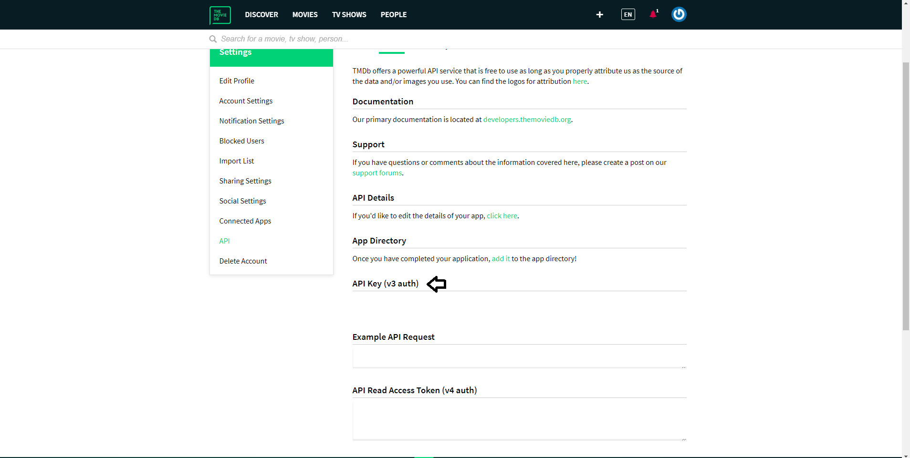

#                                                       FindMovies🎞
 
 Um projeto que surgiu após assistir um vídeo no YouTube e uma conversa com um amigo de trabalho, o qual deu a idéia de construir uma aplicação que recomendasse um filme a partir de um gênero, trazendo sua avaliação no IMDB e seu resumo.
	
  # Descrição✏
  ##### API
  
  A API que utilizei para esse projeto: https://www.themoviedb.org/documentation/api.  
Para utilizar é necessário realizar um cadastro no site deles:
https://www.themoviedb.org/account/signup  
Após realizar o cadastro, e na parte de Configurações, vai ter um campo API Key(v3 auth): 
https://www.themoviedb.org/settings/api  
 
 

	Substituir API_KEY='{SUA_KEY}' no código.
	Em Home/index.js.
	

  # Instalação 
  ##### Clonar Repositório
	git clone https://github.com/VilasBoas1407/FindMovies.git
	
 ##### Instalar dependências 📀
 	npm install 
	
 ##### Iniciar o projeto 📱
 	yarn start
	ou
	npm start

# Links🌎
	Yarn - https://yarnpkg.com/	
	NodeJs - https://nodejs.org/en/
##### GitHub Amigo do Trabalho	
https://github.com/vitorahh

 ##### Vídeo Motivação
  Desafio: 10 projetos rápidos para treinar Programação e conseguir um Emprego:	https://www.youtube.com/watch?v=fYR9L2ZmodM
